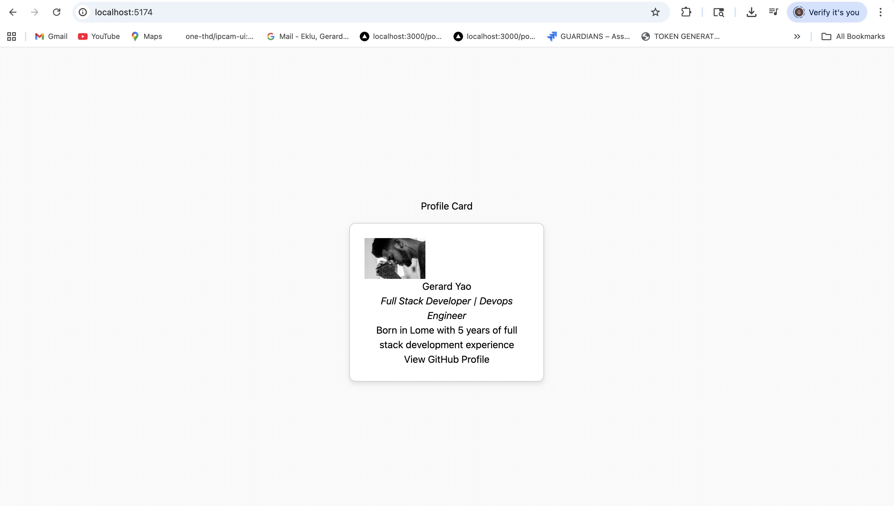

# 🚀 React Mastery Journey

This repository documents my focused React refresh building hands-on projects to deepen my frontend expertise as I transition into advanced full-stack and DevOps roles.

The app is bootstrapped with **Vite + React**, and includes modern tooling like ESLint and Prettier.

---

## 🧠 Week 1 – React Basics

| Project                                                      | Description                                                            |
| ------------------------------------------------------------ | ---------------------------------------------------------------------- |
| [`01-profile-card`](./week-01-react-basics/01-profile-card/) | A simple card component displaying name, role, bio, and GitHub profile |
| `02-team-roster/`                                            | Coming Soon                                                            |

---

## 🧰 Tech Stack

- ⚛️ React (functional components only)
- ⚡ Vite (fast dev server, HMR)
- 🧹 ESLint + Prettier (clean code formatting)

---

## 📷 Screenshots



---

## 🧪 Dev Setup

```bash
npm install
npm run dev
```
