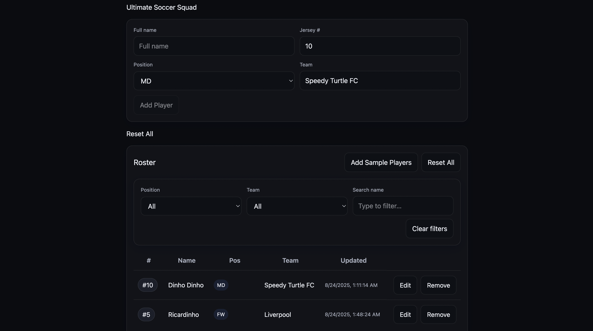

# Ultimate Soccer Squad (React + Zustand + RHF + Zod)

A tiny, modern React app for managing a soccer team roster. Add, edit, remove, filter players and the roster **persists** across refreshes (via `zustand` + `persist` to `localStorage`). The UI is a lightweight dark theme using a single global CSS file.

---

## ✨ Features

- Create players with **name**, **jersey number**, **position** (`GK/DF/MD/FW`), **team`**
- Inline **edit / save / cancel** and **remove** with confirm dialogs
- **Filters**: by position, team, and free‑text name search
- **Add Sample Players** seeding for demos
- **Reset All** (with confirm)
- **Persistence** with SSR‑safe `localStorage`
- **Validation** using React Hook Form + Zod

---

## 🧱 Tech Stack

- **React** (Vite)
- **Zustand** for global state
- **zustand/middleware** `persist` + `createJSONStorage`
- **React Hook Form** + **Zod** for forms/validation
- **TypeScript** throughout
- Plain CSS (no UI framework)

---

## 🚀 Quick Start

```bash
# install deps
npm i
# app deps used:
npm i zustand react-hook-form zod @hookform/resolvers

# dev server
npm run dev
# production build
npm run build && npm run preview
```

**Prereqs:** Node 18+ recommended.

---

## 📁 Folder Structure

```
src/
  components/
    HydrationGate.tsx     # waits for persisted state to hydrate before rendering
    RosterForm.tsx        # add form (RHF + Zod)
    RosterFilters.tsx     # position/team/name filters + Clear
    RosterList.tsx        # table + inline edit/remove, reset, seeding
  store/
    rosterStore.ts        # Zustand store + persist (SSR‑safe)
  styles/
    roster.css            # global styles, tokens, button variants
  types.ts                # Position union + Player interface
  App.tsx                 # wires it all together
```

---

## 🔌 State, Persistence & SSR

- The store exposes a hook: `useRoster` with `{ players, addPlayer, updatePlayer, removePlayer, reset }`.
- Persistence uses:

  ```ts
  const storage =
    typeof window !== 'undefined'
      ? createJSONStorage(() => window.localStorage)
      : undefined;

  export const useRoster = create<RosterState>()(
    persist(
      (set, get) => ({
        /* actions */
      }),
      {
        name: 'soccer_roster_v1',
        storage,
        version: 1,
      }
    )
  );
  ```

- `HydrationGate` defers rendering until `useRoster.persist.hasHydrated()` is true to avoid “flash of empty state”.

### Optional: Migrations later

If you change the `Player` shape, bump the version and add `migrate`:

```ts
persist(
  (set, get) => ({
    /* actions */
  }),
  {
    name: 'soccer_roster_v1',
    storage,
    version: 2,
    migrate: (persisted, from) => {
      if (from < 2 && persisted?.state?.players) {
        // example: add missing field with default
        persisted.state.players = persisted.state.players.map((p: any) => ({
          ...p,
          team: p.team ?? 'Unknown',
        }));
      }
      return persisted;
    },
  }
);
```

---

## ✅ Forms & Validation (RHF + Zod)

- Schema centralizes rules; numbers are coerced from inputs:

```ts
const schema = z.object({
  name: z.string().min(2),
  number: z.coerce.number().int().min(1).max(99),
  position: z.enum(['GK', 'DF', 'MD', 'FW'] as const),
  team: z.string().min(1),
});
```

- RHF provides the typed `data` to `addPlayer(data)` and the form resets to defaults.

---

## 🎛 Filters

- Position (ALL/GK/DF/MD/FW)
- Team (derived from current players)
- Text query on `name`
- Clear filters button

---

## 🎨 Styling

- Global tokens: colors, radii, shadows.
- Components: `.card`, `.input`, `.btn` (`.btn-primary`, `.btn-ghost`, `.btn-danger-outline`), `.table`, `.badge`, `.chip`, `.muted`.
- Higher‑specificity selectors ensure our buttons override default UA styles.

---

## 🧪 Testing Ideas (optional)

- Store actions are pure → unit test `add/update/remove/reset` easily.
- Component tests: add flow, inline edit flow, filter behavior, persistence rehydration.

---

## 🧭 Gotchas Solved

- **SSR + localStorage**: construct `createJSONStorage` only when `window` exists.
- **Hydration flicker**: `HydrationGate` hides UI until rehydration completes.
- **Zod enum options mismatch**: older Zod doesn’t accept `{ required_error }` on `z.enum`; we use plain `z.enum`.
- **Type mismatch in resolver**: if versions are old, type the resolver as `Resolver<FormData>`.

---

## 📌 Notes

- Midfield code uses `'MD'`. If you prefer `'MF'`, update the union and UI options consistently.
- Local seeding is provided for demo (`Add Sample Players`). Remove it for production.

---

## 📜 License

MIT

---

## 🧰 Useful Commands

```bash
# format / lint (if you add tooling)
npm run lint
npm run format
```

---

## 📷 Screenshots (optional)



---

## 🙌 Acknowledgements

Built by Gerard Eklu. Guidance and code review assistance via ChatGPT. All code was audited, tested, and finalized by me.
